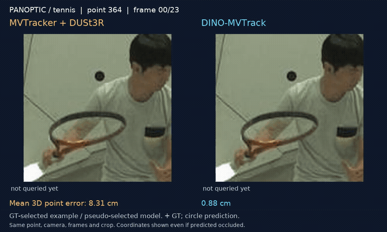
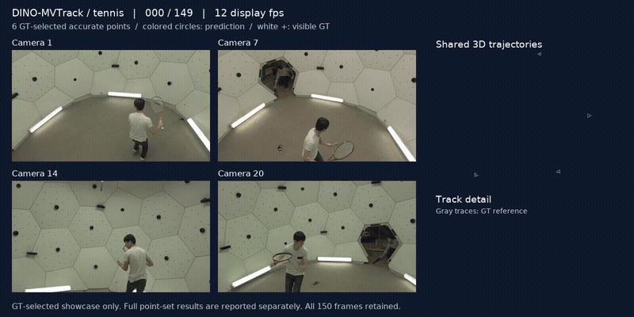

# DINO-MVTrack

**Multi-View 3D Point Tracking via Unsupervised Test-Time Optimization**

DINO-MVTrack combines frozen DINO features, calibrated multi-view geometry,
and per-scene optimization to estimate 3D point trajectories from 2D pseudo
tracks. It takes synchronized RGB views, camera calibration, task queries,
and prepared tracker inputs.

[Project website](https://richard-henry.github.io/DINO-MVTrack/) ·
[Usage](docs/usage.md) · [Data format](docs/data-format.md) ·
[License and attribution](NOTICE.md)

## Visual examples



**Same point, camera, frames and crop.** MVTracker + DUSt3R (left) and
DINO-MVTrack (right); magenta crosses show GT. This is a **GT-selected success
case using the pseudo-selected model**, on the mixed point cohort. Point 364
stays within 1.6 cm of GT throughout its active trajectory. Its point
error is not a dataset-level result. The website also shows a within-scene
median point and a failure case.



**Six accurate points, 150 frames, four cameras.** These fixed points are
**selected using GT error over the complete sequence**, with a worst-frame
error check. Their individual mean 3D errors are 2.92–5.62 cm. Colored circles
show predictions; white crosses show visible GT. This is a curated showcase,
not an estimate of overall tracking quality.

The full
sequence uses a historical CoTracker **offline** teacher, followed by overlapping
24-frame fits and merging. Full-sequence results on the **complete original point set**: 3D AJ: **35.55%**; MTE: **25.69 cm**.
Later-frame errors remain substantial across that complete point set. Playback speed is illustrative, not
runtime; source fps is unverified.

The [website](https://richard-henry.github.io/DINO-MVTrack/) includes the full
videos, editable method figure and dataset-level results. Pseudo-selected
results and **per-scene GT-best saved results** are presented separately.
[Media provenance](website/assets/provenance.json) and
[result provenance](website/assets/result-provenance.json) identify the point
sets, selection rules and exact prediction hashes.

To preview the website locally (no build step):

```bash
python scripts/preview_website.py
# Open http://localhost:8765
```

## Installation

Use Python 3.10 and a CUDA-enabled PyTorch installation. For example:

```bash
git clone git@github.com:richard-henry/DINO-MVTrack.git
cd DINO-MVTrack
conda create -n dino-mvtrack python=3.10 -y
conda activate dino-mvtrack
pip install torch==2.4.1 torchvision==0.19.1 --index-url https://download.pytorch.org/whl/cu121
pip install -r requirements.txt
```

Choose a CUDA build appropriate for your driver using the
[official PyTorch installation matrix](https://docs.pytorch.org/get-started/previous-versions/).
Frozen DINOv3 feature extraction can use a separate environment; see the usage
guide. Optimization consumes the resulting cache without upgrading Transformers.

## Track a prepared scene

Copy `configs/scene.example.json` to `configs/scene.json`, and set the paths to
your data, point cache, triangulation, DINO feature cache, and initial weights.
Relative paths are resolved from the scene configuration file.

```bash
# Check actual input identities and cached features; no optimization.
python -m track3d.cli.track check --scene-config configs/scene.json

# Optimize one scene and export 3D tracks and multi-view 2D projections.
python -m track3d.cli.track optimize \
  --scene-config configs/scene.json --output outputs/example
```

The default configuration uses four views, 24 frames, 128 point slots, and eight
internal search iterations. Optimization starts with a budget of 240 updates
and continues to 320 only when that budget is exhausted without reaching the
registered loss plateau. Predictions are selected by the pseudo-supervised
loss rule. Existing output directories are never overwritten by this entry point.

The [usage guide](docs/usage.md) covers point selection, triangulation, feature
preparation, prediction export, and evaluation.

## Inputs and availability

The repository contains the runtime implementation and supporting utilities.
Datasets, pretrained components, scene caches, and model weights are external.
**Public download links for the experiment-specific common initialization and
extracted tracker encoder are not yet provided.** The optimization command
requires these compatible artifacts and fails when required inputs are absent.
This is not yet a one-command reproduction package.

The current data adapter reads the exported benchmark scene format, including
reference annotations used for queries, metadata, and evaluation. The
optimization loss uses pseudo tracks rather than GT trajectories. This does
not imply that every pretrained component or evaluation choice is unsupervised.
GT-conditioned point selection and GT-selected checkpoints must be distinguished
from ordinary input preparation and pseudo-supervised model selection.

## Repository structure

```text
configs/           Tracker settings, stopping rule, and scene configuration
track3d/           Tracking, preprocessing, export, and evaluation interfaces
nets/              Multi-view tracking network
datasets/          Scene and triangulation input adapters
utils/             Geometry, sampling, and visualization helpers
tests/             CPU checks for the public interface
docs/              Installation, usage, and data format
website/           Static project page and final presentation assets
```

The Python package is named `track3d` for compatibility with the implementation.
The manuscript is in preparation.

## Acknowledgements

This implementation builds on [PIPS++](https://github.com/aharley/pips2).
[DINO-Tracker](https://dino-tracker.github.io/) and
[MVTracker](https://ethz-vlg.github.io/mvtracker/) are closely related works.
We use frozen DINO features alongside scene-adapted tracker features; the main
3D comparison is MVTracker with DUSt3R-estimated depth. Please retain the
[upstream license](LICENSE) and cite the original methods when using their work.

Author and publication metadata for DINO-MVTrack will be added with the paper.
